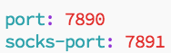

# Clash-用于服务器翻墙
1.  将自己买的梯子的订阅对应的配置文件（一般是yml后缀），复制到vpn目录下，重命名成config.yaml

2.  在vpn目录下，输入下面命令即可启动服务
    ```
    ./clash -d .
    ```
3.  查看config.yaml配置的端口信息

    例：
    

4.  在终端输入如下命令，修改http协议端口
    ```
    export https_proxy=http://0.0.0.0:7890 http_proxy=http://0.0.0.0:7890 all_proxy=socks5://0.0.0.0:7891
    ```

5.  修改域名过滤规则请参照

    https://blog.csdn.net/u013559309/article/details/129437063
    ```
    - 'DOMAIN-SUFFIX,civitai,自动选择'
    - 'DOMAIN,civitai,自动选择'
    - 'DOMAIN-KEYWORD,civitai,自动选择'
    ```

6. wget使用代理请参照

    https://blog.csdn.net/lovedingd/article/details/118824049
